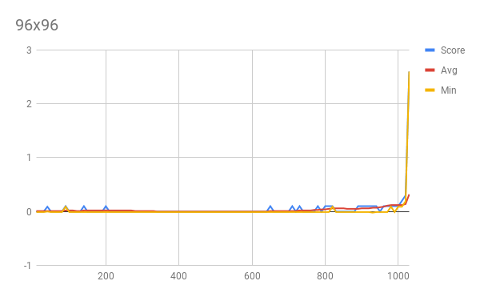
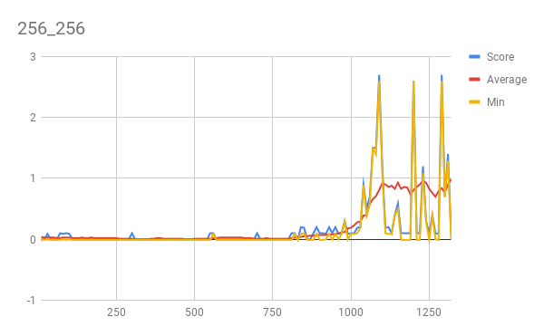

# Report

The algorithm for the agent is DDPG  with possibility of using the several improvements.

## Criteria
The environment was considered solved when the agent achieved average of 0.5+ over 100 episodes.

## Agent
### Layers
Both actor & critic use two fully connected layers.

### Activations
I sticked with a RELU for the hidden layers and tangens for the final layer. Lately I've trained
quite a lot of classifiers and I don't find other non saturating non-linearities worth the complexity
nor slowdown.

I feel that RELU quickly finds which neurons have signal. As a trick to decrease number of dead RELU
when I feel that model is relying on too few neurons, I sometimes switch to other activation functions
mid training like ELU or SELU to introduce some chaos and then switch back to RELU afterward.

### Neurons
I've settled on a 96 densely connected neurons on the both layers for both actor and critic, since it solved the environment in all the runs I've tried. Using more neurons solved the environment but it took more time. Using little less neurons like 72 took more time. While going to less then 64 neurons usually failed to solve the environment.

## Improvements

I especially aimed for decreasing the number of episodes needed to solve the environment.

### Number of Neurons
I feel that two layers of 96 neurons is close to optimal, since it consistently solved the environment from scratch. Using 48 & 64 neurons failed to solve it in 2000+ episodes.

### Smaller buffer
I've added second smaller buffer that holds 1,000 steps which reduced the training time. 
It has an effect of the agent focusing on the latest episodes.

### Random runs
I prefill the large buffer with 10,000 steps of experience generated by untrained agent.
Until the prefill is over I don't start any learning.

### Resetting agents
During the prefill process I reset the agent weights after every episode to get more random policies.

## Potential improvements
I think that try to stack the steps, or use recurrent neural network might decrease the training time. Other option is to use prioritized experience buffer. In my case smaller buffer is playing similar role, since last episodes are usually the best played.
